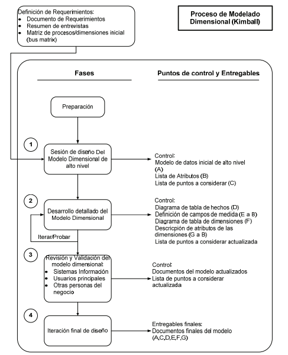
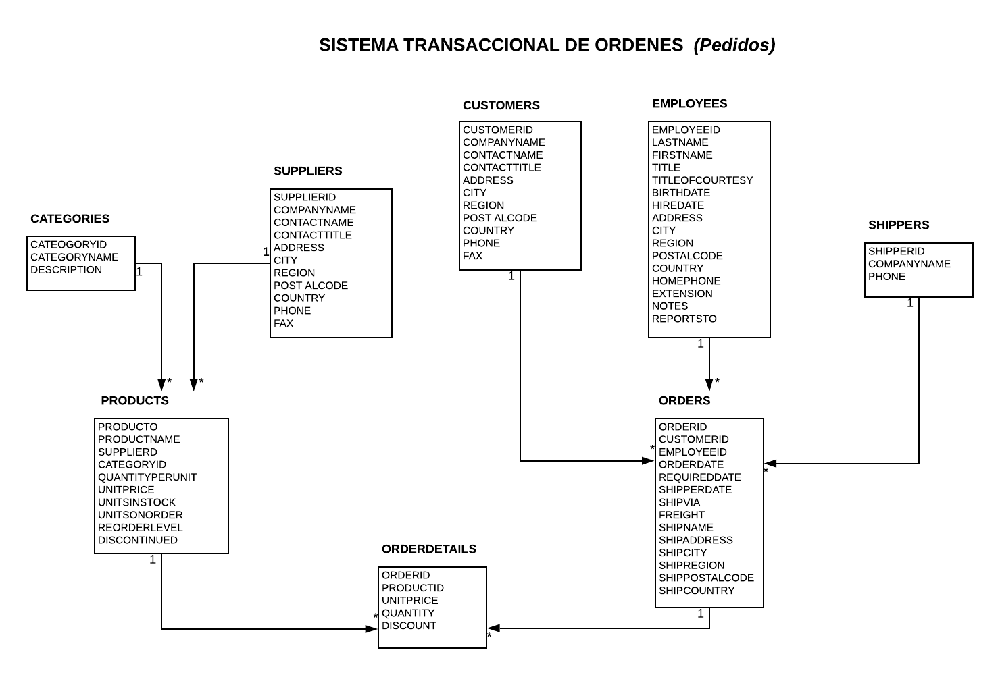
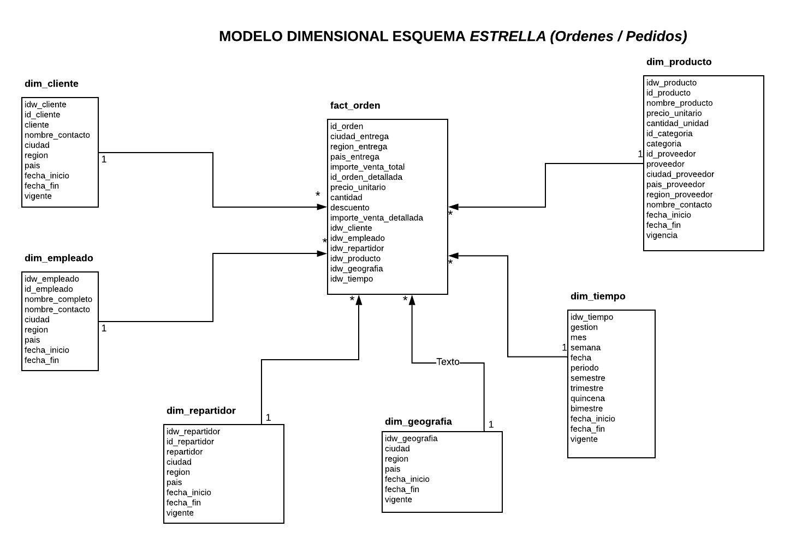
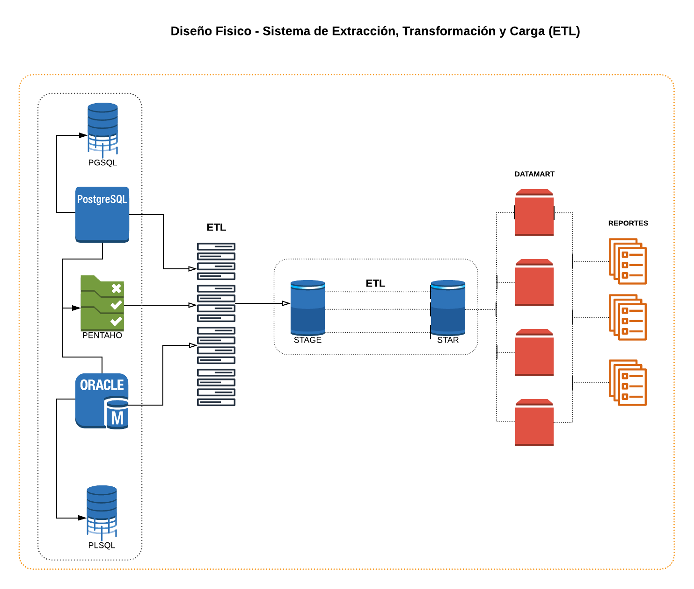

# MAESTRÍA EN CIENCIA DE DATOS V.2
# PROYECTO FINAL DE MÓDULO (Almacenes de datos, Diciembre 2020)

# TEAM X-FORCE
  - Ever Favio Argollo Ticona
  - Ivan Fernando Mujica Mamani
  - Guery Favio Ramirez Martinez
  - Sergio Ramiro Rojas Saire

### Resumen
Los almacenes de datos cada dia adquieren mayor importancia, a medida que las orga- nizaciones pasan de esquemas de solo recolección de datos a esquemas de análisis de los mismos. Sin embargo a pesar de la gran difusión de los conceptos relacionados con los almacenes de datos, no existe demasiada información disponible en castellano en cuanto a las metodologías para implementarlos. En este breve artículo intentaremos brindar una explicación general de una de las metodologías más usadas, la metodología de Kimball.

### 1. Introducción 
Un almacen de datos es considerado como una colección de datos orientada a un determiando ámbito, integrado, no volátil, y variable en el tiempo, que ayuda. Se trata, sobre todo, de un historial completo de la organización más allá de la información transaccional y operacional, almacenado en una base de datos diseñada para favorecer el análisis y la divulgación eficiente de datos. Por otra parte Kimball la define como "una copia de los datos transaccionales estructurados especificamente para consultas y análisis". Actualmente uno de los mayores impedimentos para contruir este tipo de almacenes de datos es la falta de conocimiento de metodologías adecuadas para su implementación y la disciplina para cumplirlas.

### 2. Metodologias Actuales
Entre la mayoría dos metodologías, la de Kimball y la de Inmon son las mas utlizadas desde  el punto de vista arquitectónico, la mayor diferencia entre los dos autores es el sentido de la construcción del DW, esto es comenzando por los Data marts o ascendente (Bottom-up, Kimball) o comenzando con todo el DW desde el principio, o descendente (TopDown, Inmon).
Por otra parte, la metodología de Inmon se basa en conceptos bien conocidos del diseño de bases de datos relacionales a metodología para la construcción de un sistema de este tipo es la habitual para construir un sistema de información, utilizando las herramientas habituales, al contrario de la de Kimball, que se basa en un modelado dimensional (no normalizado)

### 3. Metodología Adoptada
La metodología adoptada es la de Kimball, por ser la ideal a la practica de negocios planteada de tal forma se plantea un enfoque de mayor a menor, muy versatil y las herramientas necesarias que ayudan a la implementación de un ***Data Warehouse*** , acorde a la implementación de datamarts e integrandolos en un almacen de datos.

### 4. Metodología de Ralph Kimball 
La metodología se basa en lo que Kimball denomina Ciclo de Vida Dimensional del Negocio (Business Dimensional Lifecycle). Este ciclo de vida del proyecto de DW, está basado en cuatro principios básicos:

- Centrarse en el negocio: Hay que concentrarse en la identificación de los requerimientos del negocio y su valor asociado, y usar estos esfuerzos para desarrollar relaciones sólidas con el negocio, agudizando el análisis del mismo y la competencia consultiva de los implementadores.  
- Construir una infraestructura de información adecuada: Diseñar una base de información única, integrada, fácil de usar, de alto rendimiento donde se reflejará la amplia gama de requerimientos de negocio identificados en la empresa. 
- Realizar entregas en incrementos significativos: crear el almacén de datos (DW) en incrementos entregables. Hay que usa el valor de negocio de cada elemento identificado para determinar el orden de aplicación de los incrementos. En esto la metodología se parece a las metodologías ágiles de construcción de software. 
- Ofrecer la solución completa: proporcionar todos los elementos necesarios para entregar valor a los usuarios de negocios. Para comenzar, esto significa tener un almacén de datos sólido, bien diseñado, con calidad probada, y accesible. También se deberá entregar herramientas de consulta ad hoc, aplicaciones para informes y análisis avanzado, capacitación y soporte.

Los requerimientos del negocio son el soporte inicial de las tareas subsiguientes. En segundo lugar podemos ver tres rutas o caminos que se enfocan en tres diferentes áreas: 

- Tecnología (Camino Superior). Implica tareas relacionadas con
software específico, por ejemplo, Microsoft SQL Analysis Services. 
- Datos (Camino del medio). Se implementa el modelo dimensional, y se desarrolla el subsistema de Extracción, Transformación y Carga (Extract, Transformation, and Load - ETL) para cargar el DW. 
- Aplicaciones de Inteligencia de Negocios (Camino Inferior). En esta ruta se encuentran tareas en las que se diseña y desarrolla las aplicaciones de negocios para los usuarios finales

Estas rutas se combinan cuando se instala finalmente el sistema. Por debajo de la figura se muestra la actividad general de administración del proyecto la cual se puede describir de la siguiente forma:

### 4.1 Planificación 
En este proceso se determina el propósito del proyecto de DW/BI, sus objetivos específicos y el alcance del mismo, los principales riesgos y una aproximación inicial a las necesidades de información.
En la visión de programas y proyectos de Kimball, Proyecto, se refiere a una iteración simple del KLC (Kimball Life Cycle), desde el lanzamiento hasta el despliegue.
Esta tarea incluye las siguientes acciones típicas de un plan de proyecto: 

-  Definir el alcance (entender los requerimientos del negocio).
-  Identificar las tareas
-  Programar las tareas
-  Planificar el uso de los recursos.
-  Asignar la carga de trabajo a los recursos
-  Elaboración de un documento final que representa un plan del proyecto.

Además en esta parte se define cómo realizar la administración o gestión de esta subfase que es todo un proyecto en si mismo, con las siguientes actividades:

- Monitoreo del estado de los procesos y actividades.
- Rastreo de problemas.
- Desarrollo de una plan de comunicación comprensiva que direcciones la empresa y las áreas de TI.

### 4.2 Análisis de Requerimientos
La definición de los requerimientos es en gran medida un proceso de entrevistar al personal de negocio y técnico, pero siempre conviene tener un poco de preparación previa. Se debe aprender tanto como se pueda sobre el negocio, los competidores, la industria y los clientes del mismo. Hay que leer todos los informes posibles de la organización; rastrear los documentos de estrategia interna; entrevistar a los empleados, analizar lo que se dice en la prensa acerca de la organización, la competencia y la industria. Se deben conocer los términos y la terminología del negocio.
Parte del proceso de preparación es averiguar a quién se debe realmente entrevistar. esto normalmente implica examinar cuidadosamente el organigrama de la organización. Hay básicamente cuatro grupos de personas con las que hablar desde el principio: el directivo responsable de tomar las decisiones estratégicas; los administradores intermedios y de negocio responsables de explorar alternativas estratégicas y aplicar decisiones; personal de sistemas, si existen, la gente que realmente sabe qué tipos de problemas informáticos y de datos existen; y por último, la gente que se necesita entrevistar por razones políticas. 

A partir de las entrevistas, podemos identificar temas analíticos y procesos de negocio. Los temas analíticos agrupan requerimientos comunes en un tema común como por ejemplo:

|  Tema Analitico | Análisis o requerimiento inferido o pedido  |Proceso de negocio o soporte  | Comentarios   |
| ------------ | ------------ | ------------ | ------------ |
|   Planificacion de Ventas| Análisis historico de ordenes de ordenes de revendodores| Ordenes de Compras  | Por cliente por país, por region de ventas    |
|  |Proyección de Ventas  | Ordenes de Compras | La proyección es un proceso de negocio que usa las órdenes como entradas |

Por otra parte, a partir del análisis se puede construir una herramienta de la metodología denominada matriz de procesos/dimensiones, una dimensión es una forma o vista o criterio por medio de cual se pueden sumariar, cruzar o cortar datos numéricos a analizar, datos que se denominan medidas. Esta matriz tiene en sus filas los procesos de negocio
identificados, y en las columnas, las dimensiones identificadas. Finalmente se busca priorizar los requerimientos o procesos de negocios más críticos.

### 4.3 Modelado Dimensional
La creación de un modelo dimensional es un proceso dinámico y altamente iterativo.

El proceso de diseño comienza con un modelo dimensional de alto nivel obtenido a partir de los procesos priorizados de la matriz descrita en el punto anterior.
El proceso iterativo consiste en cuatro pasos: 

1. Elegir el proceso de negocio.
2. Establecer el nivel de granularidad.
3. Elegir las dimensiones.
4. Identificar medidas y las tablas de hechos.

### 4.3.1 Elegir el proceso de negocio
El primer paso es elegir el área a modelizar. Esta es una decisión de la dirección, y depende fundamentalmente del análisis de requerimientos y de los temas analíticos anotados en la etapa anterior.

### 4.3.2 Establecer el nivel de granularidad
La granularidad significa especificar el nivel de detalle. La elección de la granularidad depende de los requerimientos del negocio y lo que es posible a partir de los datos actuales. La sugerencia general es comenzar a diseñar el DW al mayor nivel de detalle posible, ya que se podría luego realizar agrupamientos al nivel deseado. En caso contrario
no sería posible abrir (drill-down) las sumarizaciones en caso de que el nivel de detalle no lo permita. 

### 4.3.3 Elegir las dimensiones
Las dimensiones surgen naturalmente de las discusiones del equipo, y facilitadas por la elección del nivel de granularidad y de la matriz de procesos/dimensiones. Las tablas de dimensiones tienen un conjunto de atributos (generalmente textuales) que brindan una perspectiva o forma de análisis sobre una medida en una tabla de hechos.
Una forma de identificar las tablas de dimensiones es que sus atributos son posibles candidatos para ser encabezado en los informes, tablas pivot, cubos, o cualquier forma de visualización, unidimensional o multidimensional. 

### 4.3.4 Identificar las tablas de hechos y medidas
El último paso consiste en identificar las medidas que surgen de los procesos de negocios. Una medida es un atributo (campo) de una tabla que se desea analizar, sumarizando o agrupando sus datos, usando los criterios de corte conocidos como dimensiones. Las medidas habitualmente se vinculan con el nivel de granularidad y se encuentran en tablas que denominamos tablas de hechos (fact) Cada tabla de hechos tiene como atributos una o más medidas de un proceso organizacional, de acuerdo a los requerimientos. Un registro contiene una medida expresada en números, como ser cantidad, tiempo, dinero, etc., sobre la cual se desea realizar una operación de agregación (promedio, conteo, suma, etc.) en función de una o más dimensiones. La granularidad es el nivel de detalle que posee cada registro de una tabla de hechos. 

### 4.3.5 Identificar las tablas de hechos y medidas
Se pueden caracterizar de la siguiente forma :

- Características relacionadas con la futura tabla dimensional del almacén de datos (target), por ejemplo tipo de datos, si es clave primaria, valores de ejemplo, etc. 
- El origen de los datos (source, por lo general atributos de las tablas transaccionales). 
- Reglas de conversión, transformación y carga (ETL rules), que nos dicen como transformar los datos de las tablas de origen a las del almacén de datos.

### 4.3.6 Implemntar el Modelo Dimensional
Este proceso consiste simplemente en completar la información incompleta de los pasos anteriores. El objetivo en general es identificar todos los atributos útiles y sus ubicaciones, definiciones y reglas de negocios asociadas que especifican cómo se cargan estos datos. 

### 4.3.7 Prueba del Modelo
Si el modelo ya esta estable, lo que se hace habitualmente es probarlo contra los requerimientos del negocio. Haciendo la pregunta práctica de ¿Cómo podemos obtener esta información en particular del modelo? Para las pruebas podemos usar diseños de reportes estructurados, de usuarios actuales, diseños de cubos prospectivos, etc. 

### 4.3.8 Revisión y Validacion del Modelo
Un vez que tenemos confianza plena en el modelo, se ingresa en esta etapa final, lo cual implica revisar el modelo con diferentes audiencias, cada una con diferentes conocimientos técnicos y del negocio. En el área de sistemas deberían revisarlo los programadores y analistas de los sistemas, y el DBA si existe. También
debería revisarse con usuarios y personas del negocio que tengan mucho conocimiento de los procesos y que quizás no hayan participado del diseño del modelo. Finalmente se puede hacer un documento que enuncie una serie de preguntas del negocio (tomadas a partir de los requerimientos), y las conteste por medio del modelo.

### 4.3.9 Documentos finales
Los mas importantes a mencionar serian los siguientes:

- Modelos de datos inicial de alto nivel.
- Lista de atributos.
- Diagrama de tablas de hechos.
- Definicion de campos de medida.
- Diagrama de tablas de dimensiones.
- Descripción de los atributos de las dimensiones.
- Matriz DW (o DW Bus Matrix ) completa.

### 4.4 Diseño Fisico
En esta parte se intenta contestar las siguientes preguntas:
- ¿Cómo puede determinar cuán grande será el sistema de DW/BI?
- ¿Cuáles son los factores de uso que llevarán a una configuración más grande y más compleja? 
- ¿Cómo se debe configurar el sistema? 
- ¿Cuánta memoria y servidores se necesitan? ¿Qué tipo de almacenamiento y procesadores? 
- ¿Cómo instalar el software en los servidores de desarrollo, prueba y producción? 
- ¿Qué necesitan instalar los diferentes miembros del equipo de DW/BI en sus estaciones de trabajo? 
- ¿Cómo convertir el modelo de datos lógico en un modelo de datos físicos en la base de datos relacional? 
- ¿Cómo conseguir un plan de indexación inicial?
- ¿Debe usarse la partición en las tablas relacionales?

### 4.5 Diseño del sistema de Extracción, Transformación y Carga (ETL)
El sistema de Extracción, Transformación y Carga (ETL) es la base sobre la cual se alimenta el Datawarehouse. Si el sistema ETL se diseña adecuadamente, puede extraer los datos de los sistemas de origen de datos, aplicar diferentes reglas para aumentar la calidad y consistencia de los mismos, consolidar la información proveniente de distintos sistemas, y finalmente cargar (grabar) la información en el DW en un formato acorde para la utilización por parte de las herramientas de análisis. 

### 4.6 Especificación y desarrollo de aplicaciones de BI
Una parte fundamental de todo proyecto de DW/BI está en proporcionarles a una gran comunidad de usuarios una forma más estructurada y por lo tanto, más fácil, de acceder al almacén de datos.
Proporcionamos este acceso estructurado a través de lo que llamamos aplicaciones de inteligencia de negocios (Business Intelligence Aplications). 
Las aplicaciones de BI son la cara visible de la inteligencia de negocios: los informes y aplicaciones de análisis proporcionan información útil a los usuarios. Las aplicaciones de BI incluyen un amplio espectro de tipos de informes y herramientas de análisis, que van desde informes simples de formato fijo a sofisticadas aplicaciones analíticas que usan complejos algoritmos e información del dominio. Kimball divide a estas aplicaciones en dos categorías basadas en el nivel de sofisticación, y les llama informes estándar y aplicaciones analíticas.

### 4.6.1 Informes Estándar
Los informes estándar son la base del espectro de aplicaciones de BI. Por lo general son informes relativamente simples, de formato predefinido, y parámetros de consulta fijos. En el caso más simple, son informes estáticos prealmacenados. Los informes estándar proporcionan a los usuarios un conjunto básico de información acerca de lo que está sucediendo en un área determinada de la empresa. Este tipo de aplicaciones son el caballo de batalla de la BI de la empresa.
Son informes que los usuarios usan día a día. La mayor parte de lo que piden las personas durante el proceso de definición de requisitos se clasificaría como informes estándar. Por eso es conveniente desarrollar un conjunto de informes estándar en el ciclo de vida del proyecto.

### 4.6.2 Aplicaciones Analíticas
Las aplicaciones analíticas son más complejas que los informes estándar. Normalmente se centran en un proceso de negocio específico y resumen cierta experiencia acerca de cómo analizar e interpretar ese proceso de negocio. Estas aplicaciones pueden ser muy avanzadas e incluir algoritmos y modelos de minería de datos, que ayudan a identificar oportunidades o cuestiones subyacentes en los datos. Otra característica avanzada en algunas aplicaciones analíticas es que el usuario puede pedir cambios en los sistemas transaccionales basándose en los conocimientos obtenidos del uso de la aplicación de BI. En el otro extremo del espectro, algunas aplicaciones analíticas se venden como soluciones cerradas o enlatados, y son independientes de las aplicaciones particulares de la empresa.

<!-- ### - Modelo Base

### - Modelo Dimensional

### - Diseño Fisico -  ETL
 -->
