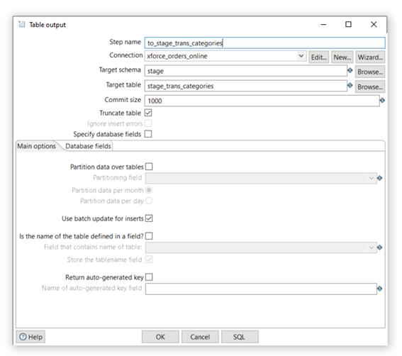

### Scripting
### Diseño y desarrollo del proceso ETL

Los sistemas o procesos ETL (Extract-Transform-Load), son la base de la construcción de cualquier sistema DataWareHouse. Un sistema bien diseñado extrae la información de los sistemas origen, asegura la calidad y consistencia de los datos, homogeniza los datos de sistemas divergentes para que puedan ser utilizados de una forma conjunta (Procesando y transformando la información de ser necesario), y finalmente genera los datos en el formato apropiado para que puedan ser utilizados por las herramientas de análisis.

##### Proceso ETL de cargado Transaction-Stage

La primera fase del proceso ETL (teniendo en cuenta que ya se cuenta con un esquema stage con las tablas necesarias creadas), consiste en realizar una copia de los datos generados en las tablas transaccionales del esquema public/ventas hasta el momento del inicio del proceso a unas tablas con la misma estructura dentro del esquema stage para lo cual se hace uso de las funciones declaradas dentro de nuestra base de datos, cuyo codigo puede ser encontrado en el presente proyecto dentro del directorio /2-etl-copia-tablas

##### Proceso ETL de cargado Stage-Stage
La segunda fase del proceso ETL consiste en realizar procedimientos de reestructuración de la información de las tablas transaccionales dentro de nuestro esquema stage para su posterior registro en las tablas dimensionales y de hechos definidas en el mismo esquema. Los procedimientos de reestructuración de los datos pueden incluir estandarización de fechas, validación y reemplazo de valores nulos entre otros. El código de estos procedimientos se encuentra definido en el directorio /3-etl-cargado-star

##### Proceso ETL de cargado Stage-Star
La tercera fase del proceso ETL consiste en copiar toda la información generada a partir de las tablas transaccionales y reestructuradas en las tablas del esquema stage hacia el esquema ofician star, no sin antes validad que la información no se encuentre repetida o registrada anteriormente en las tablas del esquema star ya que, un detalle Importante a la hora de generar los procesos ETL es estar seguros que en el esquema stage ninguna  tabla tenga información almacenada.

### Forma Gráfica (Utilizando pentaho)
La integración de datos de Pentaho (PDI) proporciona las capacidades de extracción, transformación y carga (ETL) que facilitan el proceso de captura, limpieza y almacenamiento de datos utilizando un formato uniforme y consistente que es accesible y relevante para los usuarios finales y las tecnologías de IoT.

El cliente PDI (también conocido como Spoon) es una aplicación de escritorio que le permite crear transformaciones y programar y ejecutar trabajos.

Los usos comunes del cliente PDI incluyen:

Migración de datos entre diferentes bases de datos y aplicaciones
Carga de grandes conjuntos de datos en bases de datos aprovechando al máximo los entornos de procesamiento en nube, agrupados y masivamente paralelos
Limpieza de datos con pasos que van desde transformaciones muy simples a muy complejas
Integración de datos, incluida la capacidad de aprovechar ETL en tiempo real como fuente de datos para Pentaho Reporting
Población de almacenamiento de datos con soporte integrado para dimensiones que cambian lentamente y creación de claves sustitutas (como se describe arriba)
En la perspectiva de la integración de datos, los flujos de trabajo se crean mediante pasos o entradas unidas por saltos que pasan datos de un elemento al siguiente.

Este flujo de trabajo se basa en dos tipos de archivos básicos:

Pasos de transformación: para realizar tareas ETL.

Entradas de trabajo: para orquestar actividades ETL, como definir el flujo, las dependencias y la preparación de la ejecución.

### Flujo de trabajo para la carga de datos Oracle - Postgres
El flujo que se utilizo es el siguiente:

En las 2 primeras transformaciones se realizó una configuración para que las funciones de las base de datos reconozcan al esquema indicado, luego se realizo un sub trabajo (DatosTienda) en el cual se cargaba desde la base de datos de oracle a postgres tal como se muestra en la siguiente imagen:

Dentro de este esquema, cada transformación contiene un flujo de trabajo, para esto se mostrar un ejemplo de la tabla categoría:

Veamos nuestra tabla de entrada (to_categories), el cual contiene la siguiente configuración:

Como se observa en la imagen anterior, se tiene un nombre, luego una conexión hacia la base de datos de Oracle tal como se muestra enla siguiente imagen:

En la tabla de salida se tiene la siguiente configuración:

De igual forma se cuenta con una conexión hacia la base de datos de postgres

Siguiendo nuestro flujo anterior, se tiene las demás transformaciones que hacen un llamado  a las funciones creadas dentro de la base de datos para loa carga de datos. Veamos cada una de las transformaciones:

- Transformación stage_a_dim_stage: Se hace el cargado llamando a las funciones de la base de datos, esta transformación contiene lo siguiente:

Si vemos por ejemplo el contenido de two_etl_stage_dim_producto puede verificar la ejecución de las funciones creadas anteriormente dentro de la base de datos:

- Transformación stage_a_star: Dentro de esta transformación se tiene el siguiente flujo:

- Transformación stage_fact: se tiene una transformación 

Dentro de esta transformación se hace el llamado a la función que cargara la fact dentro del stage.

- Transformación star_fact: al igual que la anterior transformación, se hace el llamado para cargar la fact dentro del esquema star.

