# 10. Diseño e implementación con Knowage

Uno de los desafíos del presente proyecto es lograr una implementación libre como alternativa a las herramientas licenciadas,
puesto que es un requerimiento frecuente en organizaciones y empresas con pocos recursos para proyectos de Inteligencia de Negocios.

Knowage es un kit de herramientas open source de Análisis de Negocio que esta compuesto por varios módulos, cada uno creado para un dominio específico del negocio, de fácil adaptación y bastante flexible, capaz de integrarse con otras herramientas de terceros.

Knowage esta basado en JAVA por lo tanto se necesitará un entorno JVM configurado con la  variable JAVA_HOME configurado correctamente. La documentación  y la aplicación de Knowage estan disponibles desde el siguiente enlace.

[Knowage](https://www.knowage-suite.com/site/)

[Documentación](https://knowage-suite.readthedocs.io/en/7.2/functionalities-guide/)

Knowage ofrece una estructura completa de gestión de roles y usuarios **out of the box**.

## Requerimientos

Para el objetivo de este documento asumiremos que ya se tiene instalado Knowage y por su puesto, el esquema o base de datos ROLAP actualizado.

## Pasos para la implementación

### Ingresando a Knowage

Knowage ofrece un set de roles y usuarios por defecto, el administrador del sistema es el usuario **biadmin**, la contraseña es **biadmin**.

### Pantalla principal

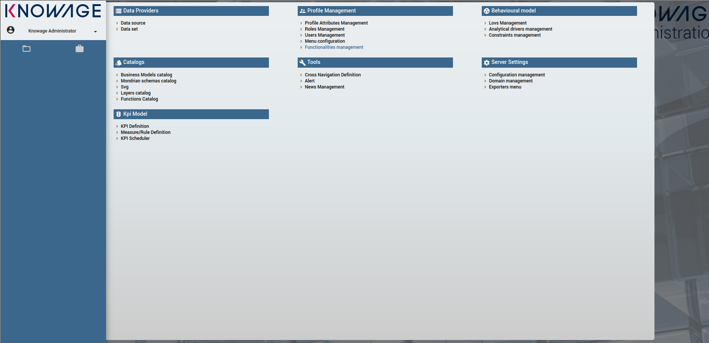

### Registrar Data Source

Knowage necesita registrar un origen de datos, es decir, una base de datos que contenga la data necesaria para construir los dashboards. Es capaz de integrarse con varios motores de base de datos, en nuestro caso proporcionaremos el driver adecuado para conectarse con Postgresql.

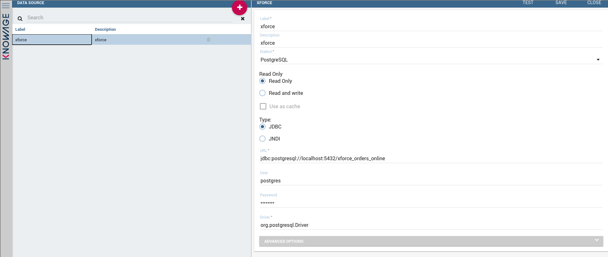

### Registrar un Dataset

Una vez registrada la fuente de datos, necesitamos registrar un dataset, es decir un bloque de datos que en escencia son datamarts, estos son usados por los widgets por ejemplo, para la visualización de charts y tablas pivoteadas.

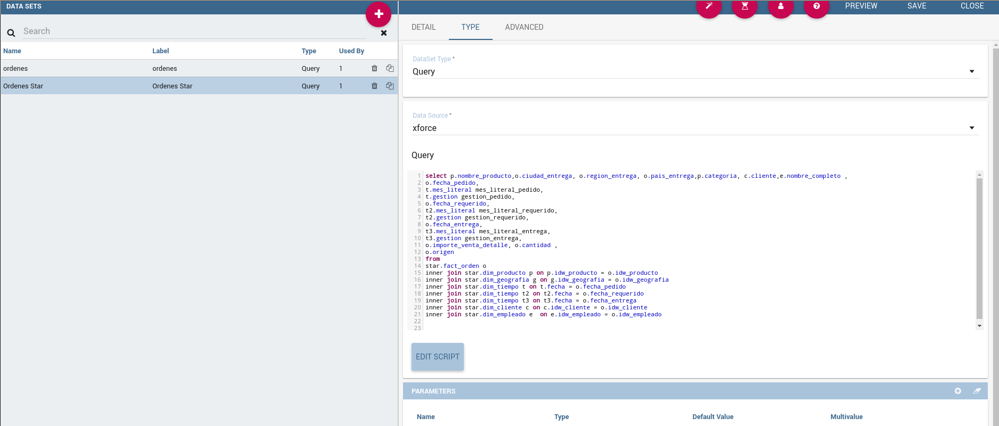

Para el proyecto vamos a registrar un dataset basado en un query SQL como se muestra en la anterio figura.

### Crear una funcionalidad

Una vez declarados los datasets necesitamos usar la modularidad que nos ofrece knowage, para ello necesitamos crear una **Funcionalidad**, sobre este se podran aplicar las reglas de securización del sistema.

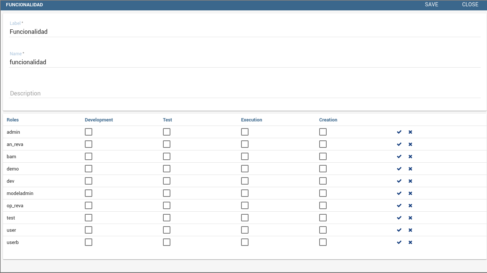

Esta funcionalidad esta disponible en el menu izquierdo del sistema.

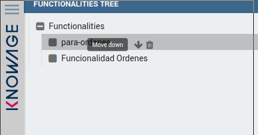

Las funcionalidades están basadas en **cockpits**, en español **cabinas**, una cabina puede contener multiples dashboards.

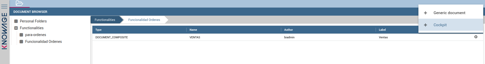

### Widgets

Knowage ofrece un variedad de widgests o componentes altamente configurables.

Para agregar un widget debemos acceder al menu plegable de la derecha

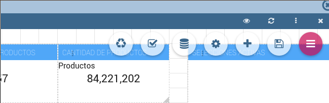

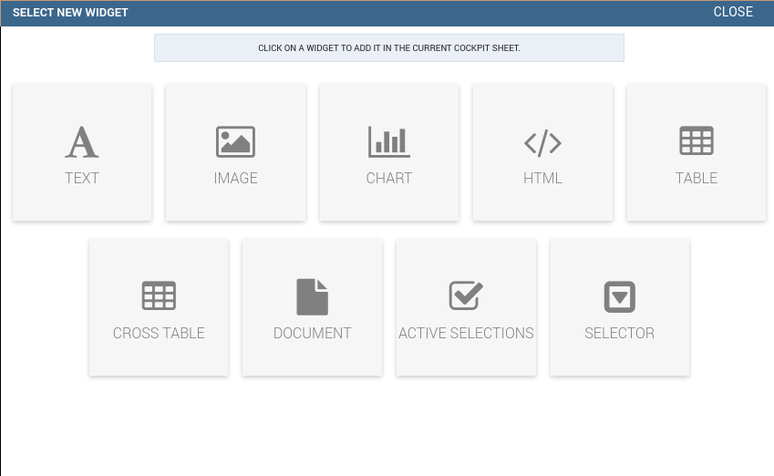

Los dos acápites mas importantes de la configuración de un widget son los apartados de **estructura**  y **estilos**.

En estructura definimos los ejes y valores del widget, en elpresente proyecto usamos barcharts, linecharts, threemaps, y tablas pivoteadas.

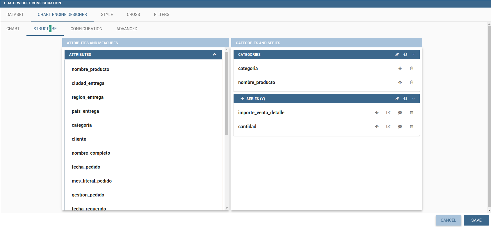

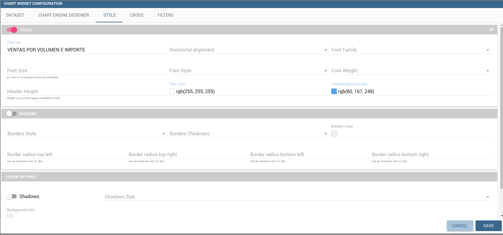

# IMPLEMENTACIÓN

Otra interesante inquietud que se pretende con el uso de una alternativa libre, es comparar la calidad de los resultados obtenidos desde PowerBI con Knowage; por lo tanto trataremos de construir en lo posible los mismos cuadros presentados en el punto 11.1.

### Volumen de Ventas

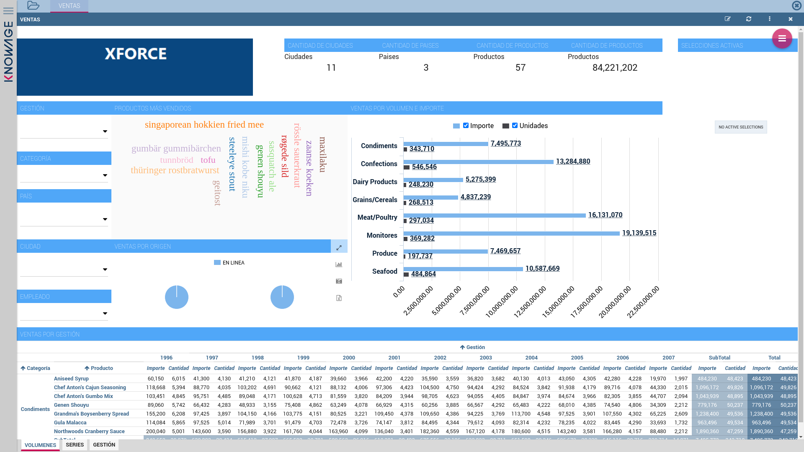

### Series temporales

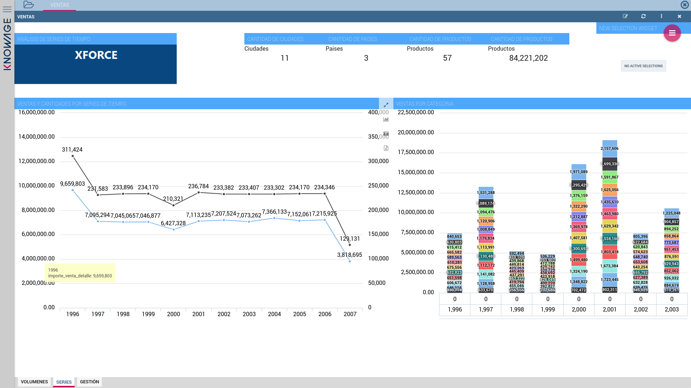

### Análisis por gestión

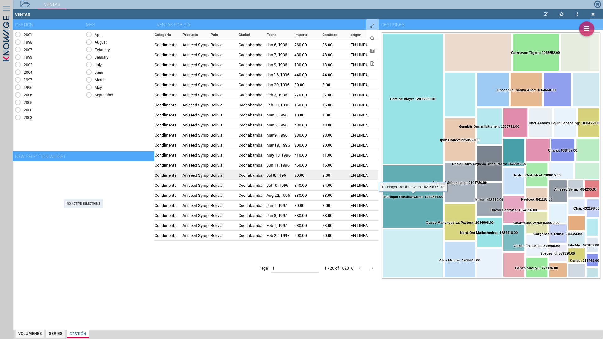