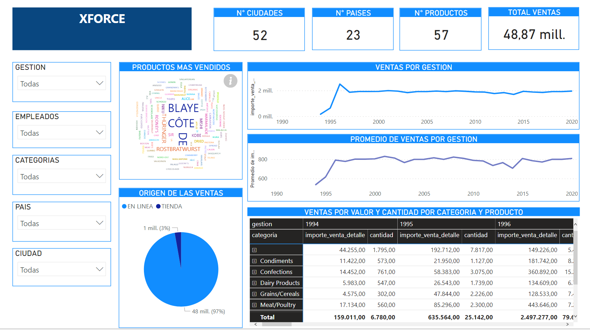
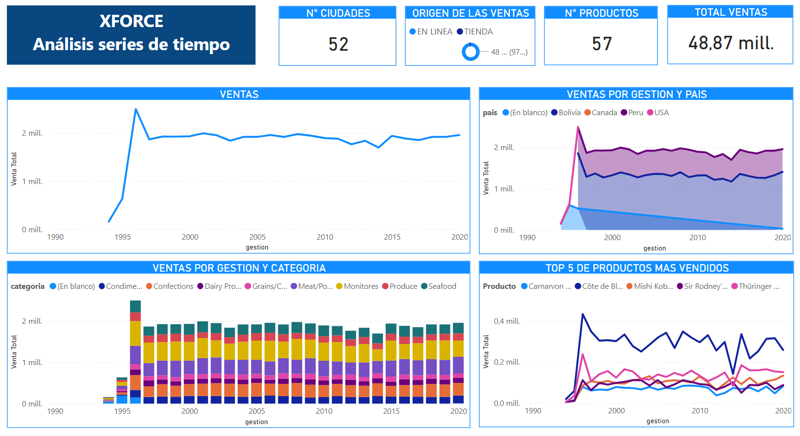
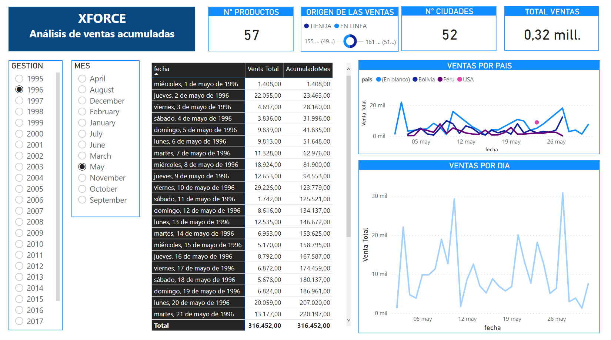
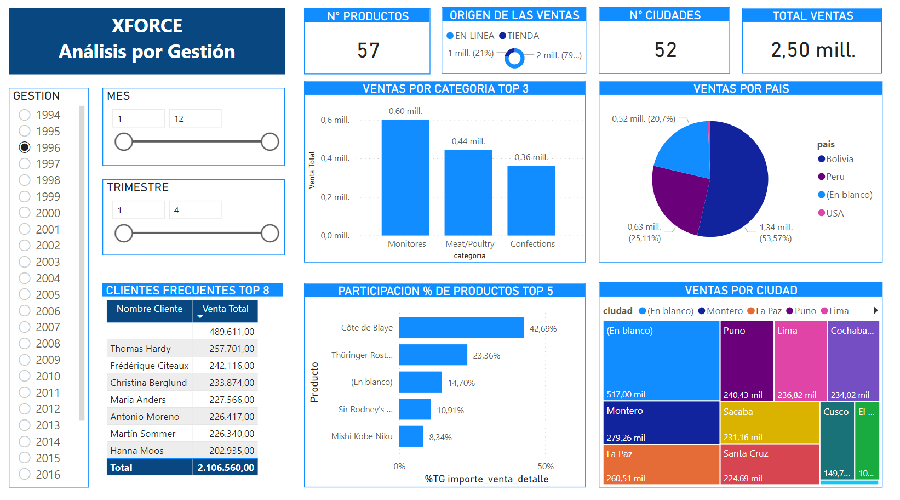

# Visualización de Datos con POWERBI

Se puede observar en línea el resultado del presente trabajo en la siguiente [URL](https://app.powerbi.com/view?r=eyJrIjoiNmI5NzhiNGEtMzFkMS00ZDFlLTk0M2YtZjI2NWFlMWEyNWE1IiwidCI6IjZjMmRjZTcwLTVjZDMtNGQwZi04YjExLTI2ZjQ0NTQ5M2VmMSIsImMiOjl9)

### Pantalla de Resultados en POWERBI

- En esta primera etapa como muestra general se observa los resultados de todas las : gestiones, empleados, categorias, paises, ciudades

**Primera Sección**
Muestra el grafico 52 ciudades, 23 paises, 57 productos, 48.87 millones de datos procesados; claramente se puede visualizar que las ventas fueron en ascenso desde 1996 y se mantuvo en linea casi continua del año 2000 para adelante y hasta 2020, de la misma manera con el **promedio**, las **ventas por valor y cantidad por categoria y producto** brindan un dettale de las mismas por gestion ademas de sus diferentes categorias. **Origen de las ventas** se visualiza que las ventas en linea predominan.

**Segunda Sección**
En esta segunda seccion se pueden apreciar **Análisis de Series de Tiempo**, donde se pueden observar las ventas como desde el año 1996 muestran un ascenso y posteriormente se mantienen relativamente constante, en cuanto a las ventas por gestion y país se ve como lidera nuestro país (Bolivia), en cuanto a las **Ventas por gestion y categoria** se observa como lidera el el producto (Seafool). En cuanto al **TOP 5 de los productos mas vendidos** una clara vision que el producto (Cöte de Blaye) encabeza frente a los demas productos (Carnarvon Tigers, Mishi Kobe Niku, Sir Rodney´s Marmalade, Thuringer Rostbratwurst
)

**Tercera Sección**

**Cuarta Sección**

- Seguidamente se muestra para las gestiones de 1994 y 1999 como parametros de rango para esa decada

