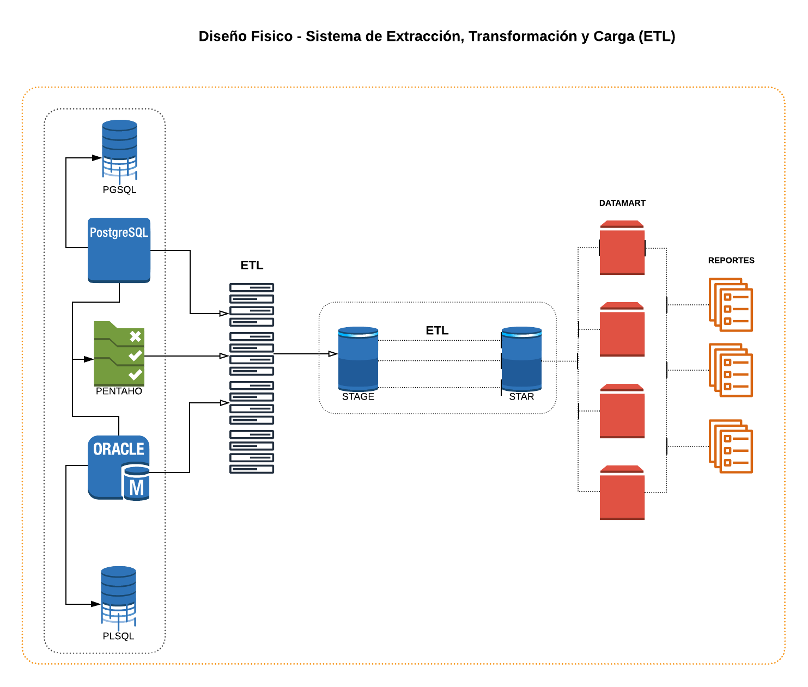

[<-volver al índice](../README.md#indice)
# 4. Diseño Técnico de la Arquitectura
Se detalla el ambiente de integración, junto con las tecnologias a utilizar, y el cómo va a funcionar, uniendo tres factores que son: los requerimientos, el entorno técnico, y las estrategias de diseño a implementar.
Para determinar el diseño técnico se basará en dos divisiones que son:

- ***Back Room***
Se implementa la integración de datos mediante el Proceso de ETL, desde el Origen de los datos hasta la carga de los mismos en el Data Warehouse que es la base destino.

- ***Front Room***
Parte pública y presentable del Data Warehouse, en la cual se implementa las aplicaciones necesarias para poder presentar al usuario final con el fin de que puedan analizar los datos almacenados en el Data Warehouse.

En esta etapa, el entregable es Diseño de la Arquitectura de todo el proceso de integración de los datos y de la presentación de los mismos, con el fin de obtener un esquema gráfico del funcionamiento del Data Warehouse.

[<-volver al índice](../README.md#indice)