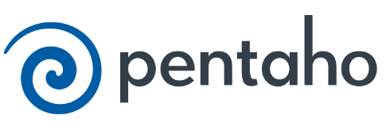

[##### <-volver al índice](../README.md#indice)
# 5. Herramientas para el Desarrollo del DataWarhouse
### Motores de Bases de Datos
Como se apreció hasta el momento un DataWarehouse es un almacén, y desde el punto de vista técnico es una base de datos con cualidades y características especificas de rendimiento. Es por ello la importancia de una Base de Datos para una aplicación de este tipo, ya que es la base, y el núcleo en el cual reposarán los datos que previamente han sido tratados.
Por lo que para la creación de la base de datos se debe tomar en cuenta ciertas funcionalidades como:
-	Alto Rendimiento y Gestión de datos.
-	Alta escalabilidad y desempeño para el crecimiento exponencial de datos, lo cual depende mucho de la cantidad de datos a tratar y ser alojados en el almacén.

Para el caso especifico se utlizaron los motores de base de datos:

-***Oracle XE :***Puede emplearse como Base de Datos de producción en pequeños negocios(Small Bussiness) tanto en intranets e internet. El soporte se da mediante un foro del mismo Oracle Corp., oracle application express , una herramienta de rápido desarrollo que permite crear aplicaciones web robustas sin necesidad de conocimientos avanzados de programación debido a su entorno declarativo, sin embargo, quienes tengan conocimientos en PL/SQL y en Ajax, pueden potenciar las aplicaciones.

-***Postgresql :***Sistema de gestión de bases de datos relacional orientado a objetos y de código abierto, publicado bajo la licencia PostgreSQL similar a la BSD o la MIT.
Como muchos otros proyectos de código abierto, el desarrollo de PostgreSQL no es manejado por una empresa o persona, sino que es dirigido por una comunidad de desarrolladores que trabajan de forma desinteresada, altruista, libre o apoyados por organizaciones comerciales. Dicha comunidad es denominada el PGDG (PostgreSQL Global Development Group).
Con todas estas características Oracle XE es la base de datos ideal para iniciarse en el mundo de Oracle para desarrollar y distribuir aplicaciones livianas de escritorio y en la Web.

### Herramienta ETL
Hoy en día existe en el mercado varias herramientas ETL de diferente proveedor ó casa comercial, aparte de esto se debe tomar en cuenta funcionalidades que permitan el buen desarrollo del Proceso ETL para lo cual se formuló características básicas que debe tener un herramienta de este tipo, lo que permite garantizar el trato de los datos.
- Extracción de datos desde archivos planos, hojas de cálculo, bases de datos.
- Carga de datos de forma masiva en bases de datos.
- Limpieza de datos.
- Interfaz gráfica amigable.
-	Unificar Datos
- Seguridad de la información transmitida.
- Retención temporal de información hasta conseguir sincronización.
- Conectividad con diferentes Motores de Base de datos.
- Soporte de la herramienta para problemas técnicos.
- Interfaz para implementación de código SQL.

De la misma manera se utlizo ***Pentaho*** ,se define a sí mismo como una plataforma de BI “orientada a la solución” y “centrada en procesos” que incluye todos los principales componentes requeridos para implementar soluciones basadas en procesos tal como ha sido concebido desde el principio.
Las soluciones que Pentaho pretende ofrecer se componen fundamentalmente de una infraestructura de herramientas de análisis e informes integrado con un motor de workflow de procesos de negocio. La plataforma será capaz de ejecutar las reglas de negocio necesarias, expresadas en forma de procesos, actividades, además es capaz de presentar y entregar la información adecuada en el momento adecuado.
Su modelo de ingresos parece estar orientado a los servicios (soporte, formación, consultoría y soporte a ISVs y distribuciones OEM) aunque en alguno de los documentos y páginas que hemos examinado se mencionan algunas funcionalidades “Premium” que hacen pensar en ingresos por futuras versiones o funcionalidades de pago.

### Herramientas de Presentación
Como parte de la explotación del DataWarehouse es importante contar con una herramienta que permita brindar una interfaz de usuario final, con facilidades y funcionalidades amigables que permitan una mayor y mejor interpretación de los datos que se encuentran en el Almacén.
Por lo que es recomendable que para la selección de una herramienta de este tipo, ella cuente con funcionalidades como:
- Visualización de gráficos para análisis.
- Navegabilidad dimensional.
- Soporte para agregaciones y sumarizaciones.
- Interfaz amigable para el usuario final.
- Opciones de filtrado o condicionales.
- Soporte a operaciones OLAP como Dril Down, Roll Up, Slice, Dice.

En cuanto a las herramientas de presentación se utilizaron ***POWER BI*** , y  ***KNOWAGE***; la primera proporciona servicios de BI basados en la nube, conocidos como “Power BI Services”, junto con una interfaz basada en escritorio, denominada “Power BI Desktop”. Ofrece capacidades de almacenamiento de datos, incluyendo preparación de datos, descubrimiento de datos y paneles interactivos, la segunda referida de código abierto para análisis de negocios modernos sobre fuentes tradicionales y sistemas de big data. Knowage es la nueva marca del proyecto SpagoBI: esta nueva marca el valor de la conocida suite de inteligencia empresarial de código abierto después de importantes transformaciones funcionales y tecnológicas y un nuevo modelo de oferta. La suite se compone de varios módulos, cada uno concebido para un dominio analítico específico. Se pueden utilizar individualmente como solución completa para una determinada tarea o combinarse entre sí para garantizar una cobertura total de los requisitos del usuario.

[##### <-volver al índice](../README.md#indice)