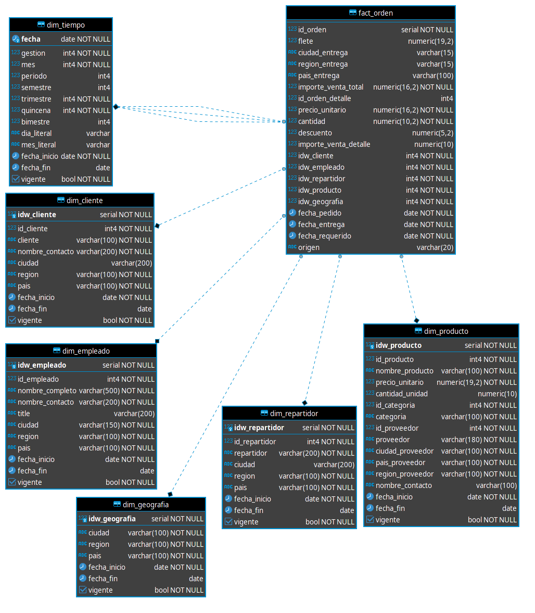

# 7. Modelamiento Dimensional
Para tal caso se observan las siguientes dimensiones:
- dim_tiempo : Dimension tiempo contiene lo referido a las diferentes variantes de tiempo en todos sus casos posibles.

- dim_cliente : Dimension cliente, especifica los datos de los potenciales clientes y sus atributos propios que los identifica en el ambito de estudio.

- dim_empleado : Dimension empleado, muestra las caracteristicas propias de los empleados en el sector a desempeñarse.

- dim repartidor : Dimension repartidor, provee el detalle de distribución mediante entes ya sean granulares o de mayor capacidad, para con los productos.

- dim_geografia : Dimension geografia, especifica los puntos geograficos sobre los que interactuan las demas dimensiones.

- dim_producto : Dimension producto, señala la caraterización propia de los distintos y variados productos dentro el sistema mismo.

- fact_orden : Tabla de hechos, la transaccional donde se reflejan los movimientos e interacciones entre las diferentes dimensiones, proveyendo las ordenes realizadas de los clientes sobre los diferentes productos, incluyendo su forma de distribucion.

